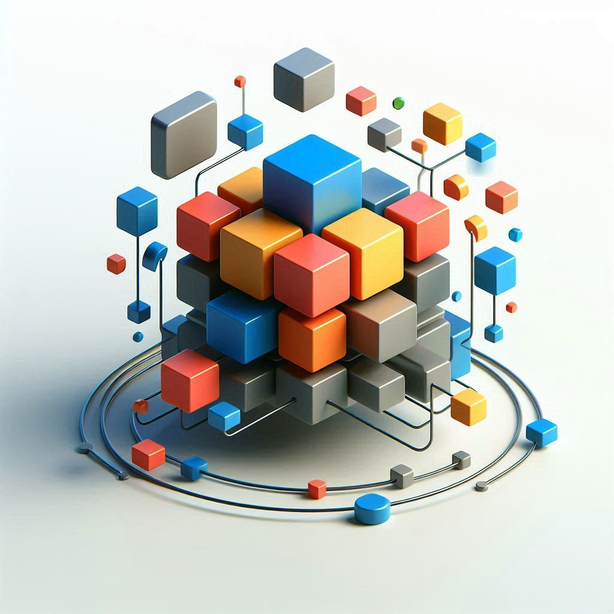
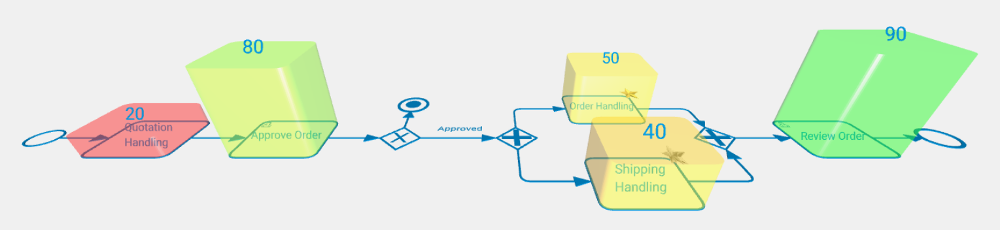

# Aurea EDEN: <br>Evolving Diagramming with Enriched Notations

[](https://github.com/robertwaszkowski/aurea-eden)
[](https://www.gnu.org/licenses/gpl-3.0)
[](https://robertwaszkowski.github.io/aurea-eden/)

<table>
    <tr>
        <td width="220" align="center" valign="top">
            
        </td>
        <td valign="top">
            <p>
                <strong>Aurea EDEN</strong> (<i>Evolving Diagramming with Enriched Notations</i>) is a flexible JavaScript library built on Three.js. It helps you create 3D diagrams, going beyond basic 2D to handle complex data better. <strong>Aurea EDEN</strong> offers extended element placement functionality, utilizes JavaScript method chaining for easy diagram manipulation, and enables users to define custom elements for any notation. This facilitates the creation of richer, more insightful models and enhances data visualization across diverse scientific and engineering domains.
            </p>
        </td>
    </tr>
</table>

## Motivation

Traditional 2D diagrams often struggle to convey the full depth of information in complex systems, leading to cluttered representations. While 3D visualization offers potential for richer semantics and improved comprehension, many tools lack the flexibility to create custom notations or integrate quantitative data directly into the visual model. Aurea EDEN addresses this gap by providing a framework that empowers users to:

* Define, adapt, and evolve their own visual notations.
* Seamlessly integrate 2D and 3D elements.
* Visualize not only the model's structure but also associated execution data or statistical parameters.

## Key Features

* **3D Diagramming:** Leverages Three.js for robust 3D rendering of diagrams.
* **Flexible Notation Development:** Easily create and customize new diagrammatic notations (e.g., UML, BPMN, or domain-specific).
* **Enriched Data Visualization:** Directly visualize quantitative data (e.g., performance metrics, statistical parameters) as 3D elements (like value bars) on diagram components.
* **Extended Element Placement:** Advanced options for positioning elements, including contextual placement relative to other elements and direct coordinate positioning.
* **Intuitive Connection Design:** Definable connection points (e.g., "north," "west") and automated routing for connectors.
* **Method Chaining API:** Simplifies diagram construction and manipulation through a fluent JavaScript API.
* **Modular Architecture:** Core components for Diagrams, Elements, Shapes, Connectors, and Materials allow for high extensibility.
* **Import/Export Capabilities:** Support for importing and exporting diagrams (extensible for various formats).
* **Multiple Diagram Modes:**
    * **VIEW Mode:** Default top-down view for standard diagram display.
    * **ANALYZE Mode:** Perspective view for 3D data visualization, automatically adding value bars and using color scales.
    * **EDIT Mode:** Top-down view intended for diagram modification operations.

## Live Demo

<a href="https://robertwaszkowski.github.io/aurea-eden/">
    
</a>

Explore Aurea EDEN's capabilities through the live demo:
[https://robertwaszkowski.github.io/aurea-eden/](https://robertwaszkowski.github.io/aurea-eden/)

## Table of Contents

- [Installation](#installation)
- [Quick Start](#quick-start)
- [Features](#features)
- [Core Components](#core-components)
- [Advanced Usage](#advanced-usage)
- [API Reference](#api-reference)
- [Contributing](#contributing)
- [License](#license)

## Installation

```bash
npm install aurea-eden
```

## Quick Start

To quickly try Aurea EDEN, create two files in your project directory:

**index.html**
```html
<!DOCTYPE html>
<html lang="en">
	<head>
        <meta charset="UTF-8">
        <title>Aurea EDEN Quick Start</title>
		<style>
			body { margin: 0; }
		</style>
	</head>
	<body>
		<script type="module" src="index.js"></script>
	</body>
</html>
```

**index.js**
```javascript
import { BpmnDiagram } from 'aurea-eden';

// Create new diagram
const diagram = new BpmnDiagram(document.body);

// Add elements
diagram.addStartEvent('e1');

diagram.addTask('a1')
    .positionRightOf('e1')
    .addWrappedText('Handle Quotations')
    .connectFrom('e1', 'E', 'W')
    .addValueBar(30);

diagram.addEndEvent('e2')
    .positionRightOf('a1')
    .connectFrom('a1', 'E', 'W');

// Arrange and display
diagram.arrange();
diagram.fitScreen();

// Add a listener to the window. 
// Let it toggle VIEW and ANALYZE modes when the user push the space key.
window.addEventListener('keydown', (event) => {
    if (event.key === ' ') {
        diagram.setMode(diagram.mode === 'VIEW' ? 'ANALYZE' : 'VIEW');
    }
});
```

Open `index.html` in your browser to see the diagram rendered.

## Vue Component Usage

For Vue.js applications, Aurea EDEN provides a dedicated component `AureaEdenBpmnDiagram`.

### Import

```javascript
import AureaEdenBpmnDiagram from 'aurea-eden/vue';
```

### Component Props

- **`bpmnXml`** (String): The BPMN XML content to render.
- **`values`** (Object): Key-value pairs matching element IDs to their values (used in `ANALYZE` mode).
- **`mode`** (String): Diagram mode (`VIEW`, `ANALYZE`, or `EDIT`). Default is `VIEW`.
- **`helpers`** (Boolean): If `true`, shows helper elements like grid and axes. Default is `false`.
- **`myActiveTasks`** (Array): List of element IDs to be marked with a Gold Star (indicating user's active tasks).
- **`otherActiveTasks`** (Array): List of element IDs to be marked with a Silver Star (indicating active tasks of others).

### Example Usage

```html
<template>
  <div style="height: 600px;">
    <AureaEdenBpmnDiagram
      :bpmnXml="xmlString"
      :values="{ 'Task_1': 42, 'Task_2': 15 }"
      mode="ANALYZE"
      :myActiveTasks="['Task_1']"
      :otherActiveTasks="['Task_3']"
      :helpers="true"
    />
  </div>
</template>
```

# Core Concepts / Architecture Overview

Aurea EDEN's architecture is modular, built around several key components:

* **Diagram:** Manages the overall scene, camera, rendering (via Three.js), elements, and connectors. Base class for specific notations (e.g., `BpmnDiagram`).
* **Element:** Represents individual components in a diagram (e.g., tasks, events). Combines shapes, materials, text, icons, and value bars. Provides methods for positioning and connecting.
* **Shape:** Defines the 3D geometry of elements and connectors (e.g., `RoundedRectangleShape`, `CircleShape`, `DiamondShape`). Custom shapes can be created by extending the base `Shape` class.
* **Connector:** Defines relationships between elements. Handles positioning and alignment, supporting custom styles and waypoints.
* **Material:** Defines the appearance (color, texture, transparency) of shapes and connectors using Three.js materials.

This architecture allows for easy extension and customization to support various diagramming needs.


# Detailed Usage / API Highlights

## Creating Diagrams

Instantiate a diagram class (either a pre-defined one like `BpmnDiagram` or a custom one).

```js
import { UmlActivityDiagram } from './lib/notations/UmlActivityDiagram.js'; // Example custom notation
const umlDiagram = new UmlActivityDiagram(document.getElementById('diagram-container'));
```

## Adding Elements

Elements are added using notation-specific methods (e.g., addStartEvent, addTask in BpmnDiagram) or a generic addElement method. Method chaining is heavily used for configuration.

```js
// BPMN Example
diagram.addTask('task1')
    .positionAt({ x: 100, y: 50, z: 0 }) // Direct positioning
    .addWrappedText('My Task Text');

// Generic element with a custom shape
import { MyCustomShape } from './lib/shapes/MyCustomShape.js';
const customShapeInstance = new MyCustomShape();
diagram.addElement('customElem1', customShapeInstance)
    .positionRightOf('task1')
    .addValueBar(90);
```

## Connecting Elements

Connect elements using the connectFrom method or by adding connectors directly.

```js
// Connect 'task2' from the 'East' point of 'task1' to the 'West' point of 'task2'
diagram.getElementByID('task2').connectFrom('task1', 'E', 'W');

// Create a custom connector with specific waypoints
const DISTANCE_BETWEEN_ELEMENTS = 48;
const waypoints = [
    diagram.getElementById('g1').getNorthPoint(),
    {   x: diagram.getElementById('g1').getNorthPoint().x,
        y: diagram.getElementById('a3').getNorthPoint().y + DISTANCE_BETWEEN_ELEMENTS },
    {   x: diagram.getElementById('a7').getNorthPoint().x,
        y: diagram.getElementById('a3').getNorthPoint().y + DISTANCE_BETWEEN_ELEMENTS },    
    diagram.getElementById('a7').getNorthPoint()
];
diagram.addFlowConnector('customFlow1', waypoints);
```

## 3D Visualization & Analysis Mode

* **Value Bars**: Use element.addValueBar(value) to associate quantitative data with an element.
* **Analyze Mode**: Switch to "ANALYZE" mode to view these values as 3D bars. The diagram tilts, and bars are color-coded (green for high, red for low).

    ```js
    diagram.getElementById('task1').addValueBar(75);
    diagram.getElementById('task2').addValueBar(30);
    diagram.setMode("ANALYZE"); // Switches to perspective view, shows bars
    ```

* **Camera Control**:
    ```js
    diagram.center();       // Center the diagram in view
    diagram.fitScreen();    // Fit the entire diagram within the viewport
    diagram.rotate(45);     // Rotate the camera view by 45 degrees around Y-axis
    ```

# Customization & Extensibility

Aurea EDEN is designed for extensibility:

## Creating New Notations:

Extend the base Diagram class. Implement methods to add notation-specific elements and connectors.
```js
// lib/notations/MyNotationDiagram.js
import { Diagram } from '../diagrams/Diagram.js';
import { Element } from '../elements/Element.js';
import { MyCustomShape } from '../shapes/MyCustomShape.js';

class MyNotationDiagram extends Diagram {
    constructor(container) {
        super(container);
    }

    addMyCustomElement(elementId, text) {
        const element = new Element(elementId, new MyCustomShape());
        this.addElement(element);
        element.addWrappedText(text);
        return element;
    }
}
export { MyNotationDiagram };
```

## Custom Shapes:

Extend the base Shape class (which itself uses THREE.BufferGeometry and THREE.Material).

```js
// lib/shapes/HexagonShape.js
import * as THREE from 'three';
import { Shape } from '../Shape.js';
import { DiagramEditMaterial } from '../../materials/DiagramEditMaterial.js';

class HexagonShape extends Shape {
    constructor(lineWidth = 1) {
        const shape = new THREE.Shape();
        const size = 30;
        // define hexagon points and shape path
        const points = [];
        for (let i = 0; i < 6; i++) {
            const angle = (i * Math.PI) / 3;
            points.push(new THREE.Vector2(size * Math.cos(angle), size * Math.sin(angle)));
        }
        shape.moveTo(points[0].x, points[0].y);
        points.forEach(point => shape.lineTo(point.x, point.y));
        shape.lineTo(points[0].x, points[0].y); // Close the shape

        const extrudeSettings = {
            steps: 2,
            depth: 1,
            bevelEnabled: true,
            bevelThickness: 0.2,
            bevelSize: 0.1,
            bevelOffset: 0,
            bevelSegments: 3
        };
        const geometry = new THREE.ExtrudeGeometry(shape, extrudeSettings);
        const material = new DiagramEditMaterial(0x006699); // Example material
        super(geometry, material);
        this.width = size * 2; // Approximate width
        this.height = size * Math.sqrt(3); // Approximate height
    }
}
export { HexagonShape };
```

## Custom Materials:

Create new materials by extending THREE.Material subclasses (e.g., `THREE.ShaderMaterial`, `THREE.MeshLambertMaterial`).

```js
// lib/materials/GradientMaterial.js
import * as THREE from 'three';

class GradientMaterial extends THREE.ShaderMaterial {
    constructor(colorStart = 0x00ff00, colorEnd = 0x0000ff) {
        super({
            uniforms: {
                colorStart: { value: new THREE.Color(colorStart) },
                colorEnd: { value: new THREE.Color(colorEnd) }
            },
            vertexShader: `
                varying vec2 vUv;
                void main() {
                    vUv = uv;
                    gl_Position = projectionMatrix * modelViewMatrix * vec4(position, 1.0);
                }
            `,
            fragmentShader: `
                uniform vec3 colorStart;
                uniform vec3 colorEnd;
                varying vec2 vUv;
                void main() {
                    gl_FragColor = vec4(mix(colorStart, colorEnd, vUv.y), 1.0);
                }
            `
        });
    }
}
export { GradientMaterial };
```

## Custom Connectors:

Define the shape of a connector by creating a class that extends `Shape` and provides the geometry (e.g., using `THREE.TubeGeometry` for a curved connector).

```js
// lib/shapes/connector/CurvedConnectorShape.js
import * as THREE from 'three';
import { Shape } from '../Shape.js';
import { DiagramEditMaterial } from '../../materials/DiagramEditMaterial.js';

class CurvedConnectorShape extends Shape {
    constructor(points) { // points is an array of {x, y, z} objects or THREE.Vector3 instances
        const curvePoints = points.map(p => new THREE.Vector3(p.x, p.y, p.z || 0));
        const curve = new THREE.CatmullRomCurve3(curvePoints);

        const tubeRadius = 0.5;
        const tubularSegments = 64;
        const radialSegments = 8;
        const closed = false;
        const geometry = new THREE.TubeGeometry(curve, tubularSegments, tubeRadius, radialSegments, closed);
        const material = new DiagramEditMaterial(0x006699); // Example material
        super(geometry, material);
    }
}
export { CurvedConnectorShape };
```

# Examples
The library includes examples, such as a `BpmnDiagram` implementation, demonstrating how to:

* Define BPMN-specific elements (Events, Tasks, Gateways) using base shapes and icons.
* Create connectors (Sequence Flows).
* Add text labels.
* Implement import functionality for BPMN data.

Aurea EDEN is also utilized in the Aurea Low-Code Development Platform (LCDP) for its Modeler and Process Analysis components.


# Dependencies

* **Three.js**: A comprehensive 3D graphics library for creating and displaying animated 3D computer graphics in a web browser.
* **@tweenjs/tween.js**: JavaScript tweening engine for easy animations.
* **SVG Loader** (part of Three.js examples): For loading and rendering SVG icons.

## Contributing

1. Fork the repository (https://github.com/robertwaszkowski/aurea-eden)
2. Create your feature branch (`git checkout -b feature/AmazingFeature`)
3. Commit your changes (`git commit -m 'Add some AmazingFeature'`)
4. Push to the branch (`git push origin feature/AmazingFeature`)
5. Open a Pull Request

## License

This project is licensed under the GNU General Public License v3.0 - see the [LICENSE](LICENSE) file for details.

## Author / Contact

Robert Waszkowski

**Email:** robert.waszkowski@wat.edu.pl

**GitHub:** [robertwaszkowski/aurea-eden](https://github.com/robertwaszkowski/aurea-eden)
