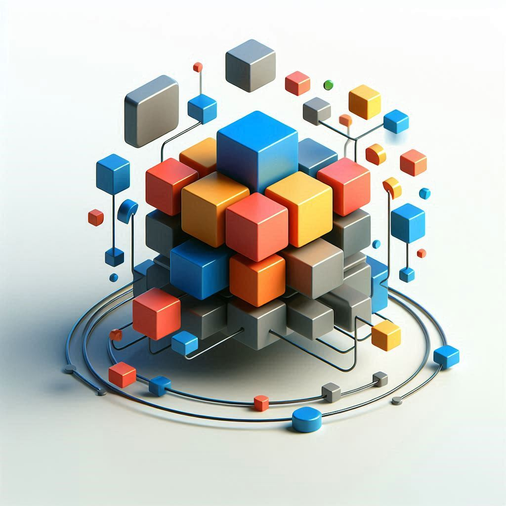
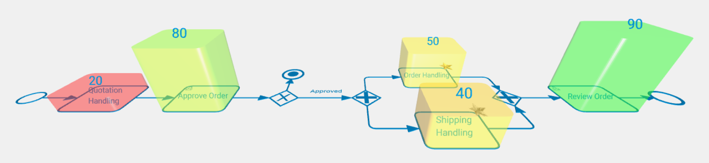

# Aurea EDEN — Evolving Diagramming with Enriched Notations

[](https://www.npmjs.com/package/aurea-eden)
[](https://www.gnu.org/licenses/gpl-3.0)
[](https://robertwaszkowski.github.io/aurea-eden/)

<table>
    <tr>
        <td width="220" align="center" valign="top">
            
        </td>
        <td valign="top">
            <p>
                <strong>Aurea EDEN</strong> (<em>Evolving Diagramming with Enriched Notations</em>) is a JavaScript library built on <a href="https://threejs.org/">Three.js</a> for creating interactive 3D diagrams. It goes beyond static 2D rendering to support custom visual notations, quantitative data overlays (value bars), animated badges, and multiple camera modes — all via a clean, chainable API.
            </p>
            <p>
                Designed for <strong>scientific, engineering, and business process domains</strong> where a diagram needs to communicate not only structure but also runtime data, performance metrics, or process state.
            </p>
        </td>
    </tr>
</table>

## Table of Contents

- [Motivation](#motivation)
- [Key Features](#key-features)
- [Live Demo](#live-demo)
- [Installation](#installation)
- [Quick Start](#quick-start)
- [Vue Component Usage](#vue-component-usage)
- [Core Concepts](#core-concepts)
- [API Reference](#api-reference)
  - [Diagram Modes](#diagram-modes)
  - [Element Placement](#element-placement)
  - [Connecting Elements](#connecting-elements)
  - [Value Bars (ANALYZE mode)](#value-bars-analyze-mode)
  - [Badges](#badges)
  - [Theming](#theming)
  - [Camera Controls](#camera-controls)
- [Extensibility](#extensibility)
  - [Custom Notations](#custom-notations)
  - [Custom Shapes](#custom-shapes)
  - [Custom Materials](#custom-materials)
  - [Custom Connectors](#custom-connectors)
- [Project Structure](#project-structure)
- [Development](#development)
- [Deployment](#deployment)
- [Dependencies](#dependencies)
- [Contributing](#contributing)
- [License](#license)

---

## Motivation

Traditional 2D diagrams often struggle to convey the full depth of information in complex systems. While 3D visualization offers richer semantics and improved comprehension, most tools lack the flexibility to:

- Define and evolve **custom visual notations** (UML, BPMN, domain-specific).
- Integrate **quantitative data** (KPIs, performance metrics) directly into models.
- Seamlessly switch between **structural (2D) and analytical (3D) views** of the same diagram.

Aurea EDEN addresses this gap.

---

## Key Features

| Feature | Description |
|---|---|
| **3D Diagramming** | Powered by Three.js — orthographic VIEW, perspective EDIT and perspective ANALYZE modes |
| **Custom Notations** | Extend `Diagram` and `Shape` to build UML, BPMN, or domain-specific diagrams |
| **Value Bars** | Animate 3D data columns atop elements in ANALYZE mode — color-coded per slot |
| **Multiple Bars** | Elements can carry 1–N side-by-side bars, independently normalized per slot |
| **Active Task Badges** | Gold/silver animated 3D star badges for my-task / other-task process states |
| **Native Auto-Layout** | Robust 2-pass BFS topology engine with support for geometric user overrides |
| **Headless Graphs** | Decoupled semantics allow instantiating and exporting zero-coordinate edges natively |
| **Method Chaining API** | Fluent, composable API: `.addTask().positionRightOf().addValueBar()...` |
| **BPMN Import** | Parse BPMN 2.0 XML and render it as a live 3D diagram |
| **Vue Component** | Drop-in `<AureaEdenBpmnDiagram>` component for Vue 3 / Vuetify apps |
| **Theming** | LIGHT / DARK themes with semantic color overrides per element type |
| **Animated Transitions** | Smooth camera animations between VIEW ↔ ANALYZE ↔ EDIT modes using Tween.js |

---

## Live Demo

[](https://robertwaszkowski.github.io/aurea-eden/)

**[➜ Open the live demo](https://robertwaszkowski.github.io/aurea-eden/)**

The demo includes:
- **Simple BPMN** — basic diagram rendering from BPMN XML.
- **Order Processing Demo** — multi-bar value visualization with inverted color scales.
- **Vue Wrapper Demo** — full Vue 3 integration with reactive props.
- **Badges Demo** — animated gold/silver star badges on active tasks.
- **Custom Notation Demo** — user-defined shapes and element types.
- **Shapes Demo** — gallery of all built-in shapes.

---

## Installation

```bash
npm install aurea-eden
```

---

## Quick Start

Create two files in your project:

**index.html**
```html
<!DOCTYPE html>
<html lang="en">
  <head>
    <meta charset="UTF-8">
    <title>Aurea EDEN Quick Start</title>
    <style>body { margin: 0; }</style>
  </head>
  <body>
    <script type="module" src="index.js"></script>
  </body>
</html>
```

**index.js**
```javascript
import { BpmnDiagram } from 'aurea-eden';

const diagram = new BpmnDiagram(document.body);

diagram.addStartEvent('e1');

diagram.addTask('a1')
    .positionRightOf('e1')
    .addWrappedText('Handle Quotations')
    .connectFrom('e1', 'E', 'W')
    .addValueBar(30);

diagram.addEndEvent('e2')
    .positionRightOf('a1')
    .connectFrom('a1', 'E', 'W');

diagram.arrange();
diagram.fitScreen();

// Toggle VIEW ↔ ANALYZE with the space bar
window.addEventListener('keydown', (event) => {
    if (event.key === ' ') {
        diagram.setMode(diagram.mode === 'VIEW' ? 'ANALYZE' : 'VIEW');
    }
});
```

Open `index.html` in any modern browser. Press **Space** to animate between VIEW and ANALYZE modes.

---

## Vue Component Usage

For Vue 3 applications, import the pre-built wrapper component:

```javascript
import AureaEdenBpmnDiagram from 'aurea-eden/vue';
```

### Props

| Prop | Type | Default | Description |
|---|---|---|---|
| `bpmnXml` | `String` | — | BPMN 2.0 XML content to render |
| `values` | `Object` | `{}` | Maps element IDs to value bar definitions (see [Value Bars](#value-bars-analyze-mode)) |
| `mode` | `String` | `'VIEW'` | `'VIEW'`, `'ANALYZE'`, or `'EDIT'` |
| `theme` | `String` | `'LIGHT'` | `'LIGHT'` or `'DARK'` |
| `helpers` | `Boolean` | `false` | Show grid / axes helpers |
| `myActiveTasks` | `Array` | `[]` | Element IDs to mark with a **gold star** (current user's active tasks) |
| `otherActiveTasks` | `Array` | `[]` | Element IDs to mark with a **silver star** (other users' active tasks) |
| `legacyStars` | `Boolean` | `false` | Use GIF-based stars instead of 3D `StarShape` |

### Example

```html
<template>
  <div style="height: 600px;">
    <AureaEdenBpmnDiagram
      :bpmnXml="xmlString"
      :values="barValues"
      :mode="currentMode"
      theme="DARK"
      :myActiveTasks="['Task_1']"
      :otherActiveTasks="['Task_3']"
    />
  </div>
</template>

<script setup>
import { ref } from 'vue';

const currentMode = ref('VIEW');

const barValues = {
  // Shorthand: single number (heightValue = colorValue, colorsInverted = false)
  'Task_1': 42,

  // Single bar with options
  'Task_2': { heightValue: 60, colorValue: 80, colorsInverted: true },

  // Two bars — shorthand array
  'Task_3': [42, 15],

  // Two bars — full control
  'Task_4': [
    { heightValue: 42, colorValue: 70 },
    { heightValue: 30, colorValue: 90, colorsInverted: true }
  ],

  // Clear bars explicitly (omitting the ID entirely also works)
  'Task_5': 0
};
</script>
```

---

## Core Concepts

Aurea EDEN's architecture is organized into five layers:

```
Diagram  (scene, camera, controls, theming, mode transitions)
  └─ Element  (3D object in the scene; carries shape, texts, icons, badges, value bars)
       └─ Shape  (THREE.js geometry + material)
  └─ Connector  (relationship line between elements; also has a Shape)
Material  (reusable THREE.js materials shared across shapes)
```

| Class | Role |
|---|---|
| `Diagram` | Manages the Three.js scene, camera, renderer, and all elements/connectors. Base class for `BpmnDiagram`. |
| `Element` | A Three.js `Object3D` that wraps a `Shape` and exposes the chainable API. |
| `Shape` | Any class that returns a `THREE.BufferGeometry` + `THREE.Material` pair. |
| `Connector` | An `Element` whose shape is a path (polyline, curve). |
| `Material` | Thin wrappers around Three.js materials for consistent visual defaults. |

---

## API Reference

### Diagram Modes

| Mode | Camera | Purpose |
|---|---|---|
| `VIEW` | Orthographic (top-down) | Default read-only display |
| `EDIT` | Perspective (top-down) | Interactive editing |
| `ANALYZE` | Perspective (tilted) | 3D value-bar visualization; camera tilts to –65° |

```javascript
diagram.setMode('ANALYZE');       // animated transition
diagram.setMode('VIEW');          // animated transition back
diagram.setMode('ANALYZE', () => console.log('done'));  // with callback
```

---

### Element Placement

Elements can be placed using absolute coordinates or relative positioning helpers:

```javascript
element.positionAt({ x: 100, y: 50, z: 0 });  // absolute
element.positionRightOf('anotherElementId');    // relative
element.positionLeftOf('anotherElementId');
element.positionAbove('anotherElementId');
element.positionBelow('anotherElementId');
```

---

### Connecting Elements

```javascript
// Fluent — connect 'task2' FROM the East point of 'task1'
diagram.getElementById('task2').connectFrom('task1', 'E', 'W');

// Manual waypoints
diagram.addFlowConnector('flow1', [
    diagram.getElementById('g1').getNorthPoint(),
    { x: 100, y: 200 },
    diagram.getElementById('a7').getNorthPoint()
]);

// Association (dashed) connector
diagram.addAssociationConnector('assoc1', waypoints);
```

Connection point identifiers: `'N'`, `'S'`, `'E'`, `'W'` (and their full-name equivalents).

---

### Auto-Layout (Topology Engine)

Aurea EDEN features a powerful, fully-native multi-pass rendering engine that eliminates the need for manual `.positionRightOf()` boilerplate when handling complex logical graphs. 

```javascript
// 1. Pass the unpositioned, arbitrary topology
// 2. Provide an optional array of manual visual overrides
diagram.autoLayout([
    { elementId: 'task_3', placementCommand: 'positionUpOf', relativeToId: 'task_2' }
]);
```
* **Pass 1:** Cleanses manual alignment drift and reorganizes the logical graph using a mathematically pure Breadth-First-Search (BFS) parallel lane strategy.
* **Pass 2:** Automatically executes a Topological Depth-First-Search (DFS) sort across your explicit visual `overrides` array, safely applying them without creating dependency cycles.
* **Pass 3:** Scans the finished scene and resolves any remaining physical AABB overlaps through geometric physics sweeps.

> **Note:** The semantic connection framework is fully decoupled from visual geometry. This means you can flawlessly instantiate hundreds of zero-coordinate sequence edges "headlessly" without breaking the engine, and then perfectly reorganize them later with a single `.autoLayout()` call!

---

### Value Bars (ANALYZE mode)

Value bars are 3D columns that rise from elements when the diagram is in `ANALYZE` mode. Each element can have **one or more** bars placed side-by-side (element width is divided equally).

#### Bar properties

| Property | Type | Default | Description |
|---|---|---|---|
| `heightValue` | `number` (0–100) | required | Visual bar height (normalized within the slot) |
| `colorValue` | `number` (0–100) | `= heightValue` | Value driving the color scale, independently of height |
| `colorsInverted` | `boolean` | `false` | `false` → higher = greener (better); `true` → higher = redder (worse) |

> Use `colorsInverted: true` for KPIs where a lower value is better (e.g. error rate, cost, processing time).

#### Chain API: `addValueBar()`

```javascript
// Positional form
.addValueBar(80)                        // height=80, color=80, normal scale
.addValueBar(80, 60)                    // height=80, color=60, normal scale
.addValueBar(80, 60, true)              // height=80, color=60, inverted scale

// Object form (identical result)
.addValueBar({ heightValue: 80 })
.addValueBar({ heightValue: 80, colorValue: 60 })
.addValueBar({ heightValue: 80, colorValue: 60, colorsInverted: true })
```

**Multi-bar example:**
```javascript
diagram.addTask('a1')
    .positionRightOf('e1')
    .addWrappedText('Handle Quotations')
    .connectFrom('e1', 'E', 'W')
    .addValueBar(20)                 // bar 1: throughput — higher is greener
    .addValueBar(60, 60, true);      // bar 2: processing time — higher is redder
```

#### Color normalization

Colors are normalized **per slot** across all elements. All elements' first bars are normalized together, all second bars separately — so each slot independently represents a different KPI dimension.

#### Clearing Bars

To remove a value bar from an element that previously displayed one, you can either:
1. Completely omit the element's ID from the `values` object in your next reactive update.
2. Explicitly set the value to `0` or an empty array `[]`.

The Vue wrapper will automatically clean up the 3D meshes without crashing the WebGL context.

#### Badge labels in ANALYZE mode

Each bar (or combined group for 3+ bars) gets an animated floating label that counts up from zero to the final value during the rise animation. If the element has an active-task type set, the label also carries the appropriate star icon.

---

### Badges

Badges are icons (3D shapes, SVG, or image URLs) attached to elements at corner positions.

```javascript
import { StarShape } from 'aurea-eden';

// 3D animated gold star at top-right
element.addBadge(new StarShape(15, 5, 0xffd700), 'top-right', null, true);

// Static SVG icon
element.addBadge('<svg>...</svg>', 'top-left');

// Image URL
element.addBadge('/icons/warning.png', 'bottom-right', 20);

// Remove all badges from an element
element.clearBadges();
```

Badge position values: `'top-left'`, `'top-right'`, `'bottom-left'`, `'bottom-right'`.

In the Vue wrapper, badges are managed automatically via the `myActiveTasks` / `otherActiveTasks` props.

---

### Theming

```javascript
diagram.setTheme('DARK');   // switches all elements, connectors, and scene background
diagram.setTheme('LIGHT');
```

Elements can be tagged with a `semanticType` string for per-type color overrides defined in `DiagramConstants.js`:

```javascript
element.semanticType = 'task';   // applies SEMANTIC_STROKE / SEMANTIC_TEXT from theme config
element.themable = true;         // opt-in to theme updates (default: true)
```

---

### Camera Controls

```javascript
diagram.fitScreen();        // Fit all elements within the viewport
diagram.center();           // Animate camera back to the initial fit position
diagram.rotate(45);         // Rotate camera around origin by 45° (Y-axis tilt)
diagram.rotate(0);          // Reset tilt (used internally on ANALYZE → VIEW exit)
```

The `fitScreen()` method supports both `OrthographicCamera` (VIEW) and `PerspectiveCamera` (EDIT/ANALYZE) and handles aspect ratio automatically.

---

## Extensibility

### Custom Notations

Extend `Diagram` and add methods that return chainable `Element` instances:

```javascript
// lib/notations/MyNotationDiagram.js
import { Diagram } from 'aurea-eden';
import { Element } from '../elements/Element.js';
import { MyCustomShape } from '../shapes/MyCustomShape.js';

class MyNotationDiagram extends Diagram {
    constructor(container, options = {}) {
        super(container, options);
    }

    addMyNode(id, label) {
        const element = new Element(id, new MyCustomShape());
        element.semanticType = 'my-node';
        element.themable = true;
        this.addElement(element);
        element.addWrappedText(label);
        return element;  // enables chaining
    }
}

export { MyNotationDiagram };
```

---

### Custom Shapes

Extend the base `Shape` class, which wraps a `THREE.BufferGeometry` and a `THREE.Material`:

```javascript
// lib/shapes/HexagonShape.js
import * as THREE from 'three';
import { Shape } from 'aurea-eden';
import { DiagramEditMaterial } from '../materials/DiagramEditMaterial.js';

class HexagonShape extends Shape {
    constructor(size = 30) {
        const outline = new THREE.Shape();
        for (let i = 0; i < 6; i++) {
            const angle = (i * Math.PI) / 3;
            const method = i === 0 ? 'moveTo' : 'lineTo';
            outline[method](size * Math.cos(angle), size * Math.sin(angle));
        }
        outline.closePath();

        const geometry = new THREE.ExtrudeGeometry(outline, {
            depth: 1, bevelEnabled: true, bevelThickness: 0.2, bevelSize: 0.1
        });

        super(geometry, new DiagramEditMaterial(0x006699));
        this.width = size * 2;
        this.height = size * Math.sqrt(3);
    }
}

export { HexagonShape };
```

---

### Custom Materials

Create any `THREE.Material` subclass. The convention in Aurea EDEN is to expose a reusable class:

```javascript
// lib/materials/GlowMaterial.js
import * as THREE from 'three';

class GlowMaterial extends THREE.MeshStandardMaterial {
    constructor(color = 0x00ffff) {
        super({
            color,
            emissive: new THREE.Color(color),
            emissiveIntensity: 0.4,
            metalness: 0.3,
            roughness: 0.2
        });
    }
}

export { GlowMaterial };
```

---

### Custom Connectors

A connector shape must extend `Shape` and produce a path geometry:

```javascript
// lib/shapes/connector/CurvedConnectorShape.js
import * as THREE from 'three';
import { Shape } from 'aurea-eden';
import { DiagramEditMaterial } from '../materials/DiagramEditMaterial.js';

class CurvedConnectorShape extends Shape {
    constructor(points) {
        const curve = new THREE.CatmullRomCurve3(
            points.map(p => new THREE.Vector3(p.x, p.y, p.z || 0))
        );
        const geometry = new THREE.TubeGeometry(curve, 64, 0.5, 8, false);
        super(geometry, new DiagramEditMaterial(0x555555));
    }
}

export { CurvedConnectorShape };
```

---

## Project Structure

```
aurea-eden/
├── data/
│   └── bpmn/               # BPMN 2.0 XML templates
├── lib/
│   ├── components/         # Vue component (AureaEdenBpmnDiagram.vue)
│   ├── connectors/         # Connector base class
│   ├── diagrams/           # Diagram base class (Diagram.js, DiagramConstants.js)
│   ├── elements/           # Element class
│   ├── loaders/            # SVG / asset loaders
│   ├── materials/          # Reusable THREE.js material wrappers
│   ├── notations/          # Built-in notations (BpmnDiagram.js)
│   └── shapes/             # All shape classes (paths, solids, bars, connectors, text)
├── demo/
│   ├── BadgesDemo/
│   ├── CustomNotationDemo/
│   ├── OrderProcessingDemo/
│   ├── ShapesDemo/
│   └── SimpleBPMN/
├── assets/                 # Static assets (logo, demo screenshots)
├── dist/                   # Built library (ES module + UMD)
├── dist-site/              # Built demo site
├── index.js                # Main demo entry point
└── package.json
```

---

## Development

Install dependencies and start the Vite development server:

```bash
npm install
npm run dev
```

The dev server starts at `http://localhost:5173/` with live-reloading. All demos in `demo/` are accessible from the index page.

### Build

```bash
npm run build:lib    # Builds the library → dist/
npm run build:site   # Builds the demo site → dist-site/
```

---

## Deployment

### Publish to npm

```bash
npm run deploy:npm
```

Make sure you are authenticated (`npm login`) before running.

### Deploy demo to GitHub Pages

```bash
npm run deploy:pages
```

Uses `gh-pages` to publish `dist-site/` to the `gh-pages` branch.

### Full release (`npm run ship`)

A single command automates the full release pipeline:

```bash
npm run ship
```

This runs, in order:

1. `npm run release` — bump version, create Git tag, update `CHANGELOG.md`.
2. `npm run update-html-version` — inject new version into `index.html`.
3. `npm run build:lib` — build library to `dist/`.
4. `npm run build:site` — build demo to `dist-site/`.
5. `npm run deploy:npm` — publish library to npm.
6. `npm run deploy:pages` — deploy demo to GitHub Pages.
7. `npm run push:git` — push commits and tags to `origin/main`.

---

## Dependencies

| Package | Purpose |
|---|---|
| [`three`](https://threejs.org/) | 3D rendering — geometry, materials, camera, renderer |
| [`@tweenjs/tween.js`](https://github.com/tweenjs/tween.js) | Smooth value animations (camera transitions, bar rise/fall) |
| [`troika-three-text`](https://github.com/protectwise/troika/tree/main/packages/troika-three-text) | High-quality SDF text rendering on 3D elements |
| [`vue`](https://vuejs.org/) / [`vuetify`](https://vuetifyjs.com/) | Required only when using the Vue wrapper component |
| [`vite`](https://vitejs.dev/) | Dev server and build tool (dev dependency) |

---

## Contributing

1. Fork the repository: [github.com/robertwaszkowski/aurea-eden](https://github.com/robertwaszkowski/aurea-eden)
2. Create a feature branch: `git checkout -b feature/my-feature`
3. Make your changes with clear, focused commits.
4. Push: `git push origin feature/my-feature`
5. Open a Pull Request describing what you changed and why.

Please follow the existing code style (ESM modules, JSDoc comments, method chaining conventions).

---

## License

GNU General Public License v3.0 — see [LICENSE](LICENSE) for details.

---

## Author

**Robert Waszkowski**
- Email: robert.waszkowski@wat.edu.pl
- GitHub: [robertwaszkowski](https://github.com/robertwaszkowski)
